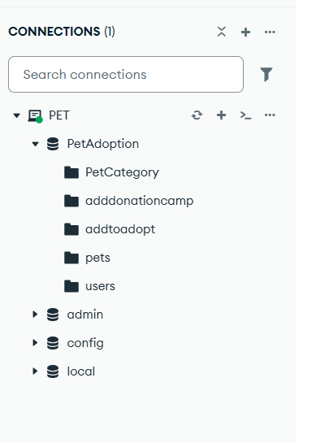

---

# 🖥️ 本地后端 + 数据库运行

---

## 1️⃣ 克隆后端项目

```bash
git clone https://github.com/Xia0-0/Pet-Adoption-Backend.git
cd Pet-Adoption-Backend
```

---

## 2️⃣ 安装依赖

```bash
npm install
```

---

## 3️⃣ 启动后端服务

```bash
node index.js
```


---

## 4️⃣ 后端服务地址

```text
http://localhost:5007
```

---

# 🗄️ 本地数据库准备（MongoDB Compass）

## 🥇 使用 MongoDB Compass（推荐）

MongoDB Compass 是 MongoDB 的可视化管理工具。

下载地址：
[https://www.mongodb.com/products/compass](https://www.mongodb.com/products/compass)

---

## 1️⃣ 连接数据库

打开 Compass，输入连接地址：

```text
mongodb://localhost:27017
```

点击 **Connect**

---

## 2️⃣ 创建数据库并导入数据

进入对应集合（如 `pets`）：

* 点击 **Add Data**
* 选择 **Import File**
* 选择 `.json`
* Format 选择 **JSON**




---

# 🧠 数据库结构说明

系统使用 MongoDB（Mongoose），主要集合如下：

| 集合名             | 作用                           |
| --------------- | ---------------------------- |
| pets            | 宠物信息（名称、品种、年龄、图片等）           |
| users           | 用户信息（登录 / 权限 / Firebase UID） |
| PetCategory     | 宠物分类                         |
| addtoadopt      | 领养申请记录                       |
| adddonationcamp | 捐赠活动记录                       |

---
